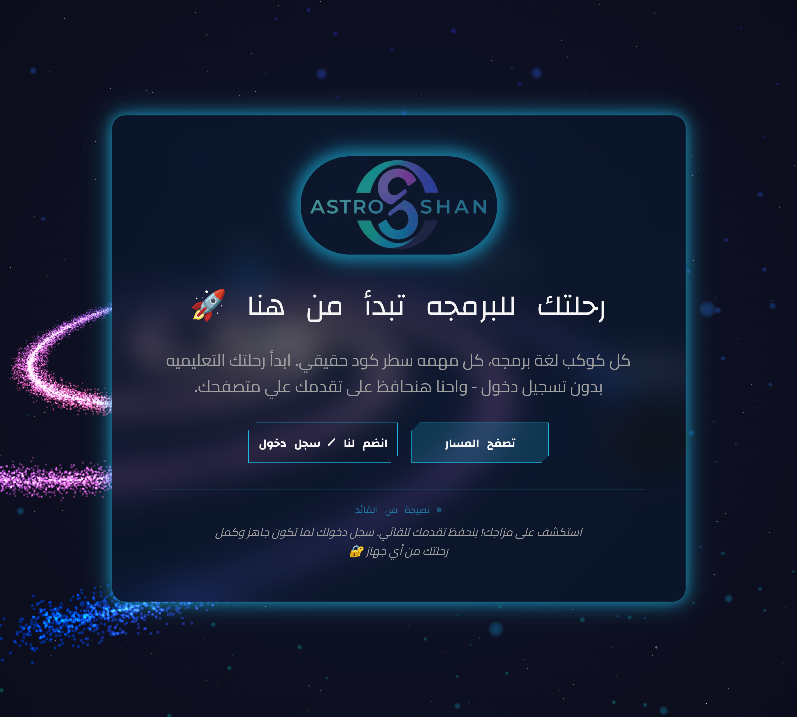
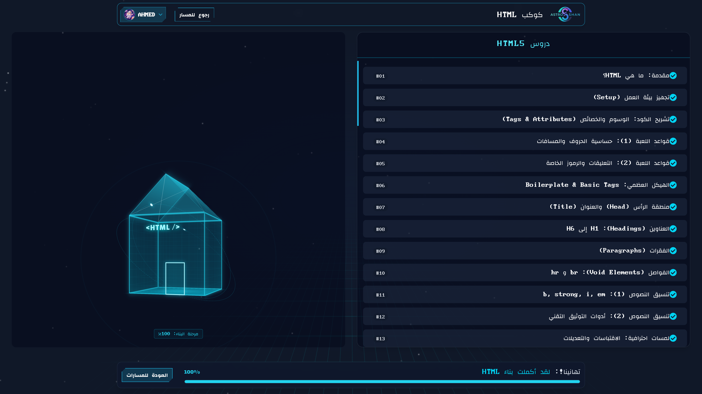
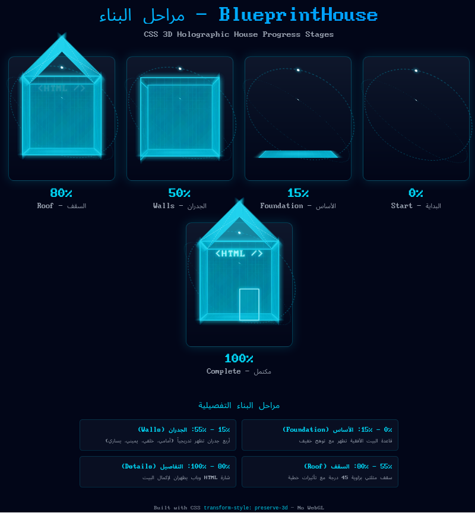
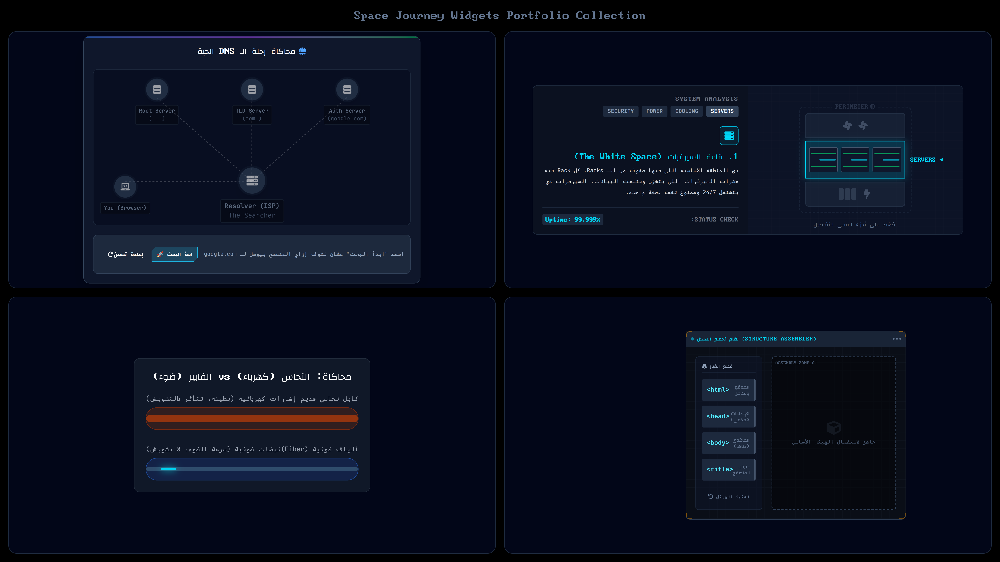
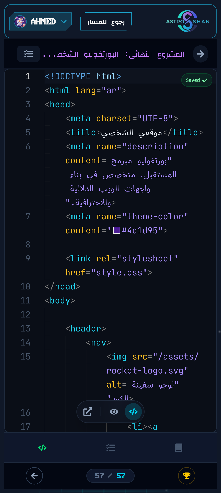

<div align="center" dir="rtl">

<!-- Animated Header -->


<br/>

### 🌌 منصة تعليمية ثلاثية الأبعاد وتفاعلية

> **تعليم تطوير الويب من خلال استكشاف الفضاء مع تقليل زمن الحجب الكلي (TBT) بنسبة 82% أثناء عرض 100,000 جسيم**

<p>
  <a href="https://astroshan.vercel.app">
    
  </a>
  <a href="#-مسار-التوثيق">
    
  </a>
  <a href="#-إحصائيات-المهمة">
    
  </a>
  <a href="README.md">
    
  </a>
</p>

<br/>



<br/>

[]()
[]()
[]()
[]()

</div>

<div align="center">

</div>

<div dir="rtl">

<br/>

## 📊 إحصائيات المهمة

<div align="center">

<table>
  <tr>
    <td align="center">
      <h3>⚡</h3>
      <b>تقليل الـ TBT</b><br/>
      <sub>-82%</sub>
    </td>
    <td align="center">
      <h3>🌌</h3>
      <b>الجسيمات (Particles)</b><br/>
      <sub>100,000</sub>
    </td>
    <td align="center">
      <h3>⭐</h3>
      <b>التقنيات المستخدمة</b><br/>
      <sub>15+ تقنية</sub>
    </td>
    <td align="center">
      <h3>👨‍🚀</h3>
      <b>الدور</b><br/>
      <sub>Solo Full-Stack</sub>
    </td>
    <td align="center">
      <h3>🚀</h3>
      <b>المدة</b><br/>
      <sub>6+ أشهر</sub>
    </td>
  </tr>
  <tr>
    <td align="center">
      <h3>🔧</h3>
      <b>Custom Hooks</b><br/>
      <sub>8</sub>
    </td>
    <td align="center">
      <h3>🧩</h3>
      <b>المكونات Components</b><br/>
      <sub>267</sub>
    </td>
    <td align="center">
      <h3>💻</h3>
      <b>عدد الأسطر البرمجية</b><br/>
      <sub>59,170</sub>
    </td>
    <td align="center">
      <h3>🎮</h3>
      <b>أدوات تفاعلية Widgets</b><br/>
      <sub>35+ محاكاة</sub>
    </td>
    <td align="center">
      <h3>📚</h3>
      <b>الدروس</b><br/>
      <sub>67 درس تفاعلي</sub>
    </td>
  </tr>
</table>

</div>

<br/>

<div align="center">

</div>

<br/>

## 🛠️ مجرة التكنولوجيا (Tech Stack)

<div align="center">

**🌟 الواجهة الأمامية (Frontend Universe)**
<p>


</p>

**🌀 الجرافيكس ثلاثي الأبعاد (3D Graphics Nebula)**
<p>


</p>

**🎬 الانيميشن وتجربة المستخدم (Animation & UX)**
<p>


</p>

**🛸 الباك إند والخدمات (Backend & Services)**
<p>


</p>

</div>

<br/>

<div align="center">

</div>

<br/>

## 🎯 نظرة عامة على المهمة

### 🌍 السياق (Context)

يسيطر على مشهد تعليم البرمجة الدورات القائمة على الفيديو حيث يشاهد الطلاب المدربين وهم يكتبون الأكواد بشكل سلبي. هذا يخلق ما يُسمى بـ **"جحيم الكورسات" (Tutorial Hell)** – حيث يمكن للمتعلمين المتابعة لكنهم يجدون صعوبة في بناء أي شيء بمفردهم. في المقابل، نادراً ما يتعلم المطورون المحترفون من الفيديوهات؛ بل يقرؤون التوثيق (Documentation)، ويجربون، ويحلون المشاكل من خلال المحاولة والخطأ.

كان **AstroShan** بمثابة خروج جذري عن هذا النمط. بدلاً من منصة كورسات أخرى، تصورت **تجربة تعليمية غامرة** حيث يصعد الطلاب على متن سفينة فضائية افتراضية ويتنقلون عبر مجرة من المعرفة. يمثل كل كوكب وحدة تكنولوجية، وكل مهمة تحدياً برمجياً حقيقياً.

> 🌙 تخدم المنصة مجتمع المطورين الناطقين بالعربية بشكل خاص، بتصميم يدعم اللغة العربية (RTL) ومحتوى مكتوب بلهجة مصرية بسيطة ومفهومة.

### ⚡ التحدي (The Challenge)

بناء منصة تعليمية ثلاثية الأبعاد غامرة يمثل تحدياً هندسياً فريداً:

| التحدي | الوصف |
|:---------:|-------------|
| 🎨 **الثراء البصري ضد الأداء** | مجرة تحتوي على 100,000 جسيم تبدو مذهلة لكنها قد تجمد الأجهزة لمدة 14+ ثانية |
| 🎮 **التفاعل ضد التعلم** | يجب أن يخدم التلعيب (Gamification) التعليم، لا أن يشتت الانتباه عنه |
| 🔓 **الدخول السلس ضد الحفظ** | لا تسجيل إجباري، ومع ذلك يجب أن يُحفظ التقدم عبر الأجهزة المختلفة |
| 💻 **أدوات احترافية ضد سهولة الوصول** | محرر كود حقيقي (Monaco) يجب أن يعمل بسلاسة على الهواتف الذكية الاقتصادية |

### 🚀 الحل (The Solution)

قمت بتصميم AstroShan حول ثلاثة مبادئ أساسية:

<table>
<tr>
<td width="33%" valign="top">

#### ⚙️ خط عرض متكيف (Adaptive Rendering)
نظام عرض ثلاثي المستويات يكتشف قدرات الجهاز:
- **مستوى عالي**: مجرة WebGL كاملة بـ 100k جسيم
- **مستوى متوسط**: WebGL بعدد جسيمات مخفض
- **مستوى منخفض**: Canvas 2D خفيف مع فيزياء مبسطة

</td>
<td width="33%" valign="top">

#### 🔐 تسجيل دخول مجهول أولاً (Anonymous-First)
يحصل كل زائر على معرف UUID فورياً ويمكنه إكمال المنهج بالكامل دون تسجيل. تقوم خوارزمية دمج ثلاثية الاتجاهات (3-way merge) بدمج التقدم المجهول مع البيانات السحابية عند تسجيل الدخول.

</td>
<td width="33%" valign="top">

#### 📖 التعليم القائم على التوثيق (Docs-First)
صفر محتوى فيديو حسب التصميم. يتعلم الطلاب من خلال قراءة دروس منظمة، والتجربة في محرر Monaco، وتلقي ملاحظات التحقق من الكود في الوقت الفعلي.

</td>
</tr>
</table>

<br/>

<div align="center">

</div>

<br/>

## 🏗️ هيكلية النظام (System Architecture)

```
┌─────────────────────────────────────────────────────────────────┐
│                     🌐 CLIENT (Browser)                          │
├───────────────────────────┬─────────────────────────────────────┤
│   React 19 + Framer       │     Three.js / Web Workers          │
│   ├── Hero (6 variants)   │     ├── useGalaxyWorker.ts          │
│   ├── HtmlLessonView      │     ├── InteractiveGalaxy.tsx       │
│   ├── CodeEditorView      │     └── BlueprintHouse (CSS 3D)     │
│   └── TaskChecklist       │                                     │
├───────────────────────────┴─────────────────────────────────────┤
│              🔄 State Management Layer                           │
│   ├── Zustand (scrollStore)                                      │
│   ├── React Context (Header, ProgressBar)                        │
│   ├── AuthStore (in-memory tokens + localStorage)                │
│   └── ProgressStore (localStorage ↔ MongoDB sync)                │
├─────────────────────────────────────────────────────────────────┤
│                    ⚡ API Routes (Serverless)                     │
│   ├── /api/auth/google/*     ─ OAuth 2.0 flow                   │
│   ├── /api/auth/token/*      ─ JWT refresh/revoke               │
│   ├── /api/progress          ─ CRUD user progress               │
│   └── /api/profile/*         ─ User profile + avatar            │
├─────────────────────────────────────────────────────────────────┤
│                     💾 Data Layer                                 │
│   ├── MongoDB Atlas (user_progress collection)                   │
│   └── Cloudinary CDN (avatars, media)                           │
└─────────────────────────────────────────────────────────────────┘
```

<br/>

### 🔑 قرارات معمارية رئيسية

<table>
<tr>
<td align="center" width="33%">

#### 🏠 محرك CSS 3D
استخدام `transform-style: preserve-3d` بلغة CSS النقية (512 سطر) لمؤشر التقدم "البيت الهولوغرافي". أخف بكثير من Three.js على الـ Main Thread.

</td>
<td align="center" width="33%">

#### ⚡ Web Worker Particles
تم نقل حسابات 100k جسيم إلى Web Worker مخصص باستخدام نقل BufferAttribute. مما حقق **تقليل في الـ TBT بنسبة 82%**.

</td>
<td align="center" width="33%">

#### 🔓 دمج المصادقة ثلاثي الاتجاهات
UUID عند الزيارة الأولى، OAuth اختياري، ودمج ذكي عند تسجيل الدخول. تجربة خالية من الاحتكاك لبدء التعلم.

</td>
</tr>
</table>

<br/>

<div align="center">

</div>

<br/>

## ✨ الميزات الأساسية

<table>
<tr>
<td width="50%" valign="top">

### 🌌 محرك مجرة ثلاثي الأبعاد متكيف
نظام عرض متعدد المستويات يقدم صوراً مذهلة على أي جهاز.

**أبرز النقاط التقنية:**
- استخدام `useDeviceTier` للكشف عن العتاد عبر `navigator.hardwareConcurrency`
- ثلاثة مسارات للعرض: WebGL ← WebGL مخفض ← Canvas 2D
- Web Worker لتفريغ حسابات الجسيمات
- استخدام `requestIdleCallback` للتحميل المؤجل

**الأثر:** 60fps سلسة من الهواتف الرائدة إلى الأجهزة الاقتصادية

</td>
<td width="50%" valign="top">

### 🏠 البيت الهولوغرافي CSS 3D
تصور للتقدم مبني بالكامل بتحويلات CSS.

**أبرز النقاط التقنية:**
- CSS نقي `transform-style: preserve-3d`
- ظهور حسب التقدم: الأساس ← الجدران ← السقف ← التفاصيل
- حلقات جسيمات تدور باستخدام CSS animation
- حالة "قيد الانتظار" (ثيم أصفر) للدخول غير المصرح به

**الأثر:** تحفيز بصري دون استهلاك موارد WebGL

</td>
</tr>
<tr>
<td width="50%" valign="top">

### ✅ محرك التحقق من الكود المباشر
تحليل DOM في الوقت الفعلي للتحقق من كود الطالب أثناء الكتابة.

**أبرز النقاط التقنية:**
- `DOMParser` يحول HTML إلى DOM قابل للتنقل
- مدققات Regex للتحقق من المتطلبات الهيكلية
- نظام تلميحات تدريجي يظهر عند الفشل
- حارس البوابة (Gatekeeper) يقفل المهام حتى اكتمال المتطلبات المسبقة

**الأثر:** ردود فعل فورية دون الحاجة لتصحيح يدوي

</td>
<td width="50%" valign="top">

### 🎯 نظام المهمات التراكمي
الكود يبقى محفوظاً عبر المهمات، مما يبني موقعاً حقيقياً طوال الرحلة.

**أبرز النقاط التقنية:**
- اكتشاف المهام السابقة للعثور على كود المهمة الماضية
- حفظ تلقائي (Auto-save) مع Debounce لمنع فقدان البيانات
- مزامنة localStorage + MongoDB لاستمرار العمل عبر الأجهزة
- كود البداية يحترم حالة المشروع الحالية

**الأثر:** الطلاب يبنون معرض أعمال حقيقي بنهاية الكورس

</td>
</tr>
</table>

<br/>

### 🔐 مصادقة ثنائية الرموز (Dual-Token Auth)

أمان بمستوى المؤسسات مع تجربة مستخدم سلسة:

| الرمز (Token) | المدة | التخزين | الحماية |
|:-----:|:--------:|:-------:|:----------:|
| 🔑 **Access Token** | 15 دقيقة | ذاكرة فقط (In-memory) | منع XSS |
| 🔄 **Refresh Token** | 7 أيام | HttpOnly cookie | منع CSRF |

- تدوير صامت (Silent rotation) للحفاظ على الجلسة دون انقطاع
- نقطة نهاية للإلغاء (Revocation) لتسجيل خروج آمن

<br/>

<div align="center">

</div>

<br/>

## 🚀 تطبيقات برمجية مميزة (Notable Implementations)

### ⚡ محرك المجرة (Web Worker Galaxy Engine)

تحتوي خلفية المجرة على 100,000 جسيم متحرك. التنفيذ الأولي تسبب في **زمن حجب كلي (TBT) قدره 14 ثانية** على الأجهزة المحمولة.

```typescript
// Conceptual architecture - simplified
export const useGalaxyWorker = (params: GalaxyWorkerParams) => {
  const [results, setResults] = useState(null);
  
  useEffect(() => {
    const worker = new Worker(
      new URL("../lib/workers/galaxyWorker.ts", import.meta.url)
    );
    
    worker.onmessage = (event) => {
      // BufferAttribute transfer - no copying
      setResults(event.data);
      worker.terminate();
    };
    
    worker.postMessage(params);
  }, [params]);
  
  return results;
};
```

**النتيجة:** انخفض الـ TBT من 14 ثانية إلى 2.5 ثانية (**-82%**) 🎉

---

### 🔄 مزامنة التقدم (3-Way Merge Progress Sync)

عندما يقوم المستخدم بتسجيل الدخول، يتم دمج تقدمه المجهول (المحلي) مع البيانات السحابية دون فقدان البيانات.

```typescript
// Conceptual merge logic
mergeProgress(local, cloud) {
  return {
    completedLessons: union(local.lessons, cloud.lessons),  // الكل مكتمل
    quizScores: max(local.scores, cloud.scores),            // أعلى الدرجات
    timestamps: latest(local.updated, cloud.updated)        // الأحدث زمنياً
  };
}
```

**النتيجة:** عدم فقدان أي بيانات، وانتقال سلس من مجهول → مسجل ✅

<br/>

<div align="center">

</div>

<br/>

## 💡 التحديات والحلول

<table>
<tr>
<td align="center" width="25%">⚠️</td>
<td><b>التحدي 1: 14 ثانية زمن حجب كلي (TBT)</b></td>
</tr>
<tr>
<td colspan="2">

**المشكلة:** توليد جسيمات المجرة (100,000 نقطة) كان يحجب الـ Main Thread تماماً، مما يجمد الأجهزة المحمولة.

**الحل:** 
- ⚡ نقل توليد الجسيمات إلى Web Worker
- ⏱️ تنفيذ `requestIdleCallback` للتحميل المؤجل
- 📱 عدد جسيمات متكيف (12k للموبايل → 100k للديسكتوب)
- 🎨 Canvas 2D كبديل للأجهزة غير القادرة على تشغيل WebGL

**النتيجة:** انخفاض الـ TBT من **14,000ms → 2,500ms (-82%)**

</td>
</tr>
<tr>
<td align="center" width="25%">💻</td>
<td><b>التحدي 2: محرر Monaco على الأجهزة الضعيفة</b></td>
</tr>
<tr>
<td colspan="2">

**المشكلة:** محرر Monaco (محرك VS Code) كان يسبب تقطيعاً ملحوظاً على الهواتف الاقتصادية.

**الحل:**
- 📦 استيراد ديناميكي مع `next/dynamic` و `ssr: false`
- 🔀 فصل المحرر عن لوحة المعاينة (React Resizable Panels)
- ⏳ تأجيل تهيئة Emmet حتى التفاعل الأول
- 🎨 ثيم مخصص لتقليل تحليل الـ CSS

**النتيجة:** المحرر يعمل بسلاسة على أجهزة بـ **2GB RAM**

</td>
</tr>
<tr>
<td align="center" width="25%">🔄</td>
<td><b>التحدي 3: محتوى عربي RTL في محرر الكود</b></td>
</tr>
<tr>
<td colspan="2">

**المشكلة:** الكود يكتب من اليسار لليمين (LTR)، لكن المنصة عربية (RTL). خلط الاتجاهات سبب مشاكل في العرض.

**الحل:**
- 📝 محرر الكود يظل LTR (المعيار للبرمجة)
- 📄 محتوى الدروس يستخدم خصائص `dir` مناسبة لكل عنصر
- 🔤 استخدام حروف تحكم Unicode للمصطلحات التقنية داخل النص
- 🎨 CSS مخصص لواجهة تدعم RTL حول كود LTR

**النتيجة:** تدفق قراءة طبيعي للعربية، وعرض صحيح للكود

</td>
</tr>
<tr>
<td align="center" width="25%">🔐</td>
<td><b>التحدي 4: مزامنة التقدم بدون تضارب (Race Conditions)</b></td>
</tr>
<tr>
<td colspan="2">

**المشكلة:** التحديثات المتزامنة بين localStorage، MongoDB، والوقت الفعلي قد تسبب تضارباً وفقداناً للبيانات.

**الحل:**
- 🚫 معامل `skipSync` يمنع حلقات المزامنة اللانهائية
- ⚛️ استخدام `$addToSet` في MongoDB للتحديثات الذرية (Atomic)
- 📡 المزامنة عبر الأحداث باستخدام `local-storage-update`
- 🔒 منع التكرار عبر تخزين الـ Promises في تحديث التوكن

**النتيجة:** تقدم متسق عبر الأجهزة، **وصفر فقدان للبيانات**

</td>
</tr>
</table>

<br/>

<div align="center">

</div>

<br/>

## 📊 النتائج والتأثير

### ⚡ مقاييس الأداء

<div align="center">

| المقياس | قبل | بعد | التحسن |
|:------:|:------:|:-----:|:-----------:|
| **زمن الحجب الكلي (TBT)** | 14,000ms | 2,500ms | 🔥 **-82%** |
| **عدد الجسيمات (موبايل)** | 100,000 | 12,000 | 📱 **متكيف** |
| **حزمة الـ JS الأولية** | ثقيلة | مقسمة (LazyMotion) | ⚡ **ملحوظ** |
| **Server-Side LCP** | ~500ms | 0ms | 🚀 **فوري** |

</div>

### ✅ إنجازات تقنية

<table>
<tr>
<td>

- ✅ بناء نظام عرض متكيف ثلاثي المستويات (WebGL → Canvas fallback)
- ✅ معمارية Web Worker لمعالجة 100k جسيم
- ✅ محرك CSS 3D بدون الحاجة لـ WebGL (512 سطر)
- ✅ مصادقة JWT ثنائية مع تدوير تلقائي صامت

</td>
<td>

- ✅ تطوير 35+ أداة تفاعلية للفيزياء والمحاكاة
- ✅ إنجاز 67 درس كامل (10 إنترنت + 57 HTML)
- ✅ مصادقة "مجهول أولاً" مع مزامنة دمج ثلاثية
- ✅ تغطية TypeScript بنسبة 100%

</td>
</tr>
</table>

### 📚 المحتوى التعليمي

<div align="center">

| الوحدة | الدروس | الأدوات (Widgets) | الحالة |
|:------:|:-------:|:-------:|:------:|
| 🌐 أساسيات الإنترنت | 10 | 10 محاكاة | ✅ مكتمل |
| 📄 إتقان HTML | 57 | 25+ تفاعلية | ✅ مكتمل |
| **الإجمالي** | **67** | **35+** | 🚀 إنتاج (Production) |

</div>

### 📈 جودة الكود (Codebase Quality)

<div align="center">

| المقياس | القيمة |
|:------:|:-----:|
| 📝 إجمالي أسطر الكود | **59,170** |
| 🔷 تغطية TypeScript | **100%** |
| 🧩 عدد المكونات | **267** |
| 🔧 Custom Hooks | **8** |
| 🔌 مسارات الـ API | **7** |

</div>

<br/>

<div align="center">

</div>

<br/>

## 🎓 الدروس المستفادة

<table>
<tr>
<td width="50%" valign="top">

### 💡 رؤى تقنية

**⚡ الـ Web Workers يحولون الأداء**
أثبت تقليل الـ TBT بنسبة 82% أن العمل الذي يستهلك المعالج يجب *دائماً* تفريغه (Offloaded). تعقيد الكود ضئيل مقارنة بمكاسب تجربة المستخدم.

**🎨 الـ CSS 3D مظلوم**
أثبت BlueprintHouse أن `preserve-3d` في CSS يصنع مرئيات ثلاثية أبعاد مذهلة دون تكلفة WebGL. للتأثيرات المحيطة، غالباً ما يكون CSS أفضل.

**🔓 "مجهول أولاً" يقلل الاحتكاك**
السماح بالوصول الكامل دون تسجيل يتيح للمستخدمين تجربة القيمة قبل الالتزام. الدمج الثلاثي يجعل التسجيل سلساً.

</td>
<td width="50%" valign="top">

### 🏗️ رؤى معمارية

**📱 الأنظمة المتكيفة تتغلب على الإعدادات الثابتة**
بناء أنظمة الكشف والبدائل (Fallbacks) يضمن الوصول لأكبر عدد ممكن من الأجهزة.

**🧩 فصل الاهتمامات يتيح التحسين**
الفصل الواضح بين مستويات العرض، إدارة الحالة، ومسارات الـ API سمح بتحسينات جراحية دقيقة.

**📖 المحتوى القائم على التوثيق قابل للتوسع**
معاملة الدروس مثل التوثيق (منظم، قابل للبحث، تدريجي) يتوسع بسهولة دون تكاليف إنتاج الفيديو.

</td>
</tr>
</table>

<br/>

<div align="center">

</div>

<br/>

## 📚 مسار التوثيق

استكشف التوثيق المفصل (باللغة الإنجليزية حالياً):

<div align="center">

| الوثيقة | الوصف |
|:--------:|:------------|
| [📋 Overview](docs/ar/01-overview.md) | سياق المشروع والرؤية |
| [❓ Problem Statement](docs/ar/02-problem-statement.md) | التحديات التي سعينا لحلها |
| [🏗️ Solution Architecture](docs/ar/03-solution-architecture.md) | تعمق في تصميم النظام |
| [✨ Key Features](docs/ar/04-key-features.md) | تفصيل الميزات ميزة تلو الأخرى |
| [🔧 Technical Decisions](docs/ar/05-technical-decisions.md) | سجلات القرارات التقنية (ADR) |
| [💡 Challenges & Solutions](docs/ar/06-challenges-solutions.md) | الحلول الهندسية للمشاكل |
| [⚡ Performance Optimization](docs/ar/07-performance.md) | كيف حققنا تقليل 82% في TBT |
| [🧪 Testing & Quality](docs/ar/08-testing-quality.md) | نهج ضمان الجودة |
| [🚀 Deployment & DevOps](docs/ar/09-deployment.md) | البنية التحتية و CI/CD |
| [📊 Results & Impact](docs/ar/10-results-impact.md) | المقاييس والنتائج |

</div>

<br/>

<div align="center">

</div>

<br/>

## 🖼️ معرض المهمة

<div align="center">

| 🌌 الصفحة الرئيسية | 📄 وحدة HTML | 💻 محرر الكود |
|:---------------:|:--------------:|:--------------:|
|  |  |  |

| 🏠 البيت الهولوغرافي | 🎮 معرض الأدوات | 📱 عرض الموبايل |
|:------------------:|:------------------:|:--------------:|
|  |  |  |

</div>

<br/>

<div align="center">

</div>

<br/>

## ⚠️ ملاحظة حول المستودع

<div align="center">

> هذا **مستودع دراسة حالة** يعرض النهج التقني والدروس المستفادة.  
> كود المشروع الفعلي مملوك وغير متاح للعامة.

</div>

<table align="center">
<tr>
<td align="center" valign="top" width="50%">

### ✅ ما يحتويه المستودع
- 📐 مخططات معمارية وتوثيق
- 📝 سجلات القرارات التقنية
- ⚡ استراتيجيات تحسين الأداء
- 💻 عينات كود (مفاهيمية/مبسطة)

</td>
<td align="center" valign="top" width="50%">

### ❌ ما لا يحتويه
- 🔒 الكود المصدري الفعلي
- 📚 المحتوى التعليمي الخاص
- 📊 بيانات المستخدمين أو التحليلات

</td>
</tr>
</table>

<br/>

<div align="center">

</div>

<br/>

<div align="center">

## 🌌 استكشف المنصة الحية

<a href="https://astroshan.vercel.app">
  
</a>

<br/><br/>

---

**هل تريد مناقشة هذا المشروع؟**

<p>
<a href="https://codeshan.vercel.app">
  
</a>
<a href="https://github.com/codeshan-1">
  
</a>
</p>

---

<br/>

Built with 💜 by **CodeShan**

⭐ Star this repo if you found it helpful!

<br/>


</div>

</div>
