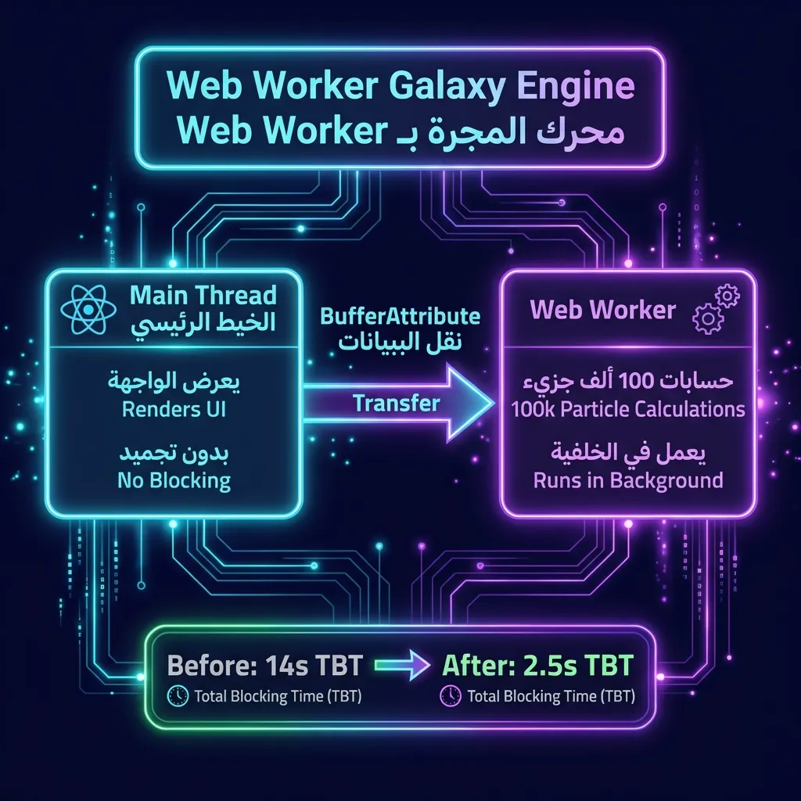
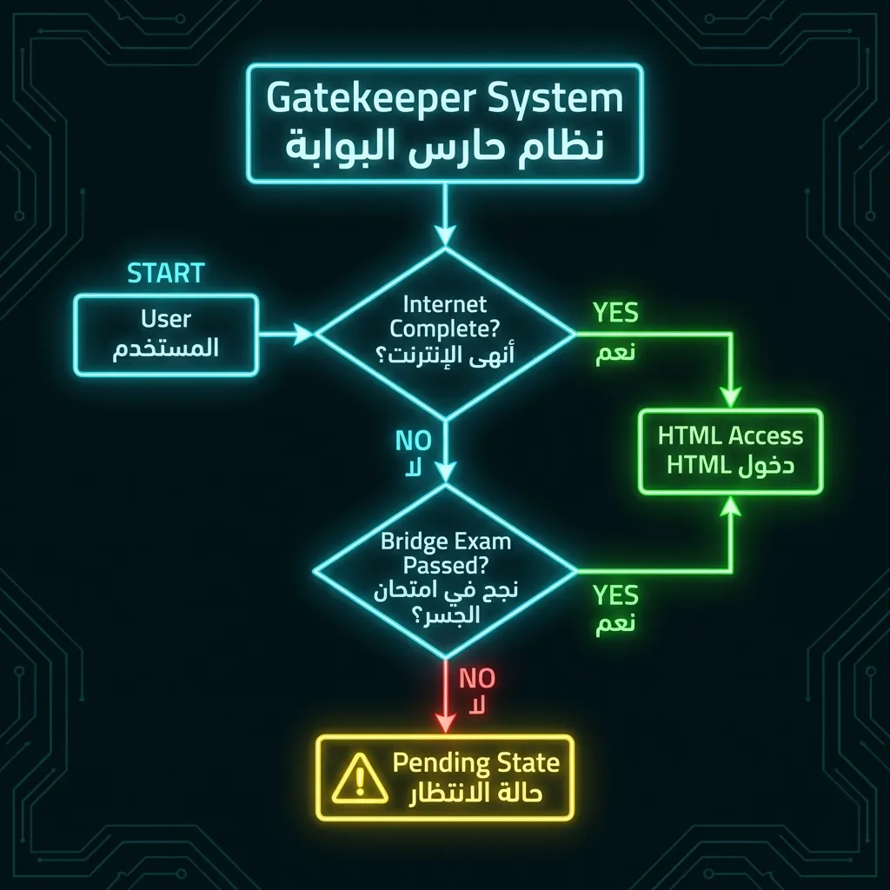
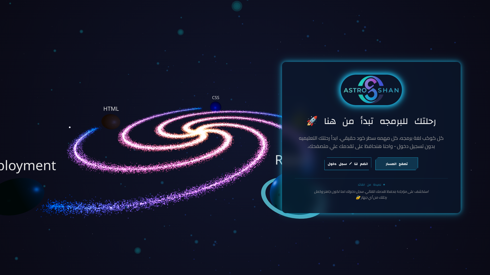
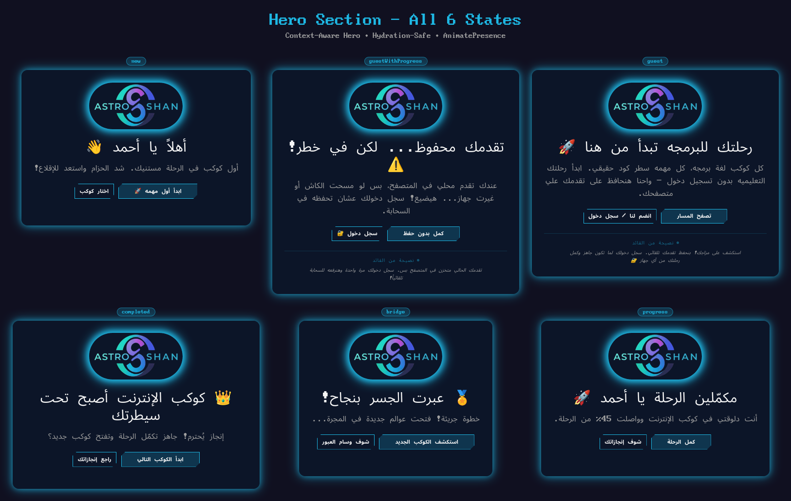
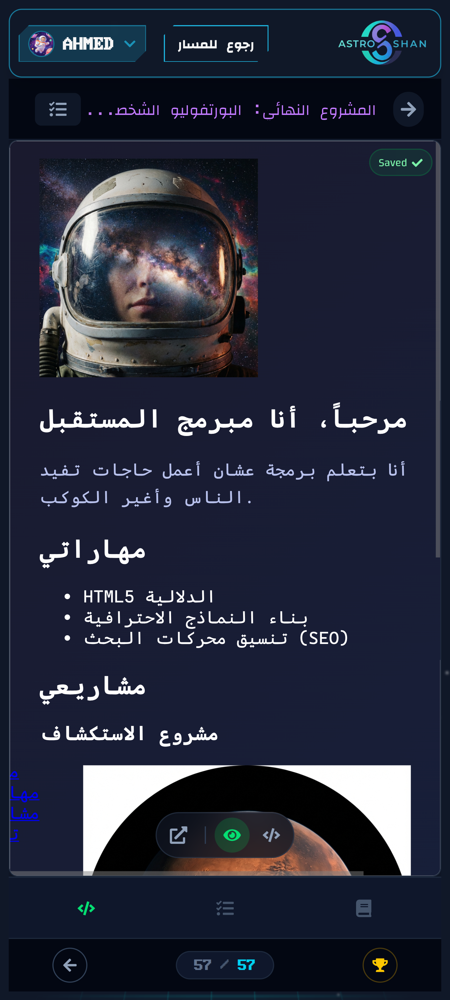
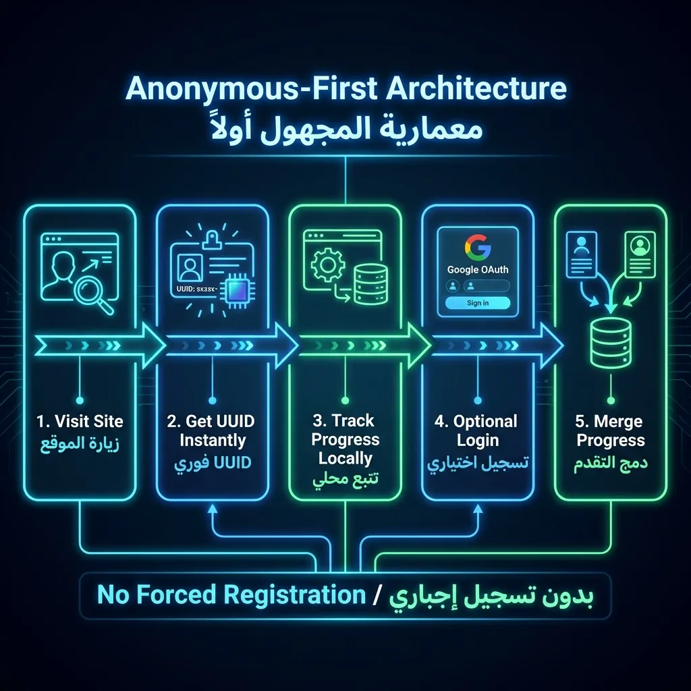
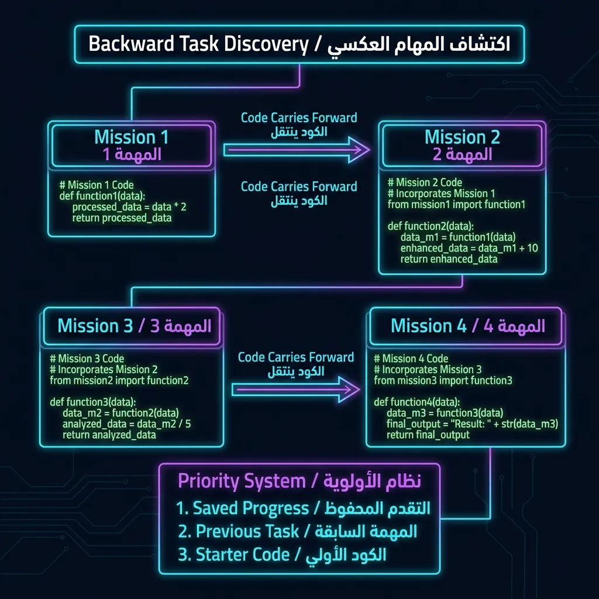

# 🚀 AstroShan — Immersive 3D Educational Platform

> **Teaching web development through space exploration — with 82% TBT reduction while rendering 100,000 particles.**


*AstroShan's landing page — an immersive 3D galaxy powered by Web Workers and adaptive rendering.*

---

## 📖 Project Overview

**AstroShan** is an immersive 3D educational platform that teaches web development through a space exploration metaphor. Instead of passive video tutorials, students board a virtual spaceship and navigate through a galaxy of knowledge — each planet represents a technology module, each mission a real coding challenge with live validation.

The platform was built as a radical departure from "Tutorial Hell," where learners can follow along but struggle to build anything independently. AstroShan adopts a **documentation-first, zero-video** approach: students learn by reading structured interactive lessons, writing real code in an embedded Monaco editor (the same engine as VS Code), and receiving immediate validation feedback. By course completion, students have built a real portfolio website from scratch.

A key engineering achievement is the **Adaptive 3D Rendering Pipeline** — a multi-tier system that detects device capabilities and delivers stunning visuals on any hardware. The 100,000-particle galaxy background achieved an **82% Total Blocking Time reduction** by offloading computation to Web Workers. The platform serves the Arabic-speaking developer community specifically, with an RTL-first design and content written in accessible Egyptian Arabic.

---

## ❓ Problem Statement

Building an immersive 3D educational platform presents a unique engineering paradox:

**1. Visual Richness vs. Performance**
A 100,000-particle animated galaxy looks stunning — but the initial implementation completely froze mobile devices for **14+ seconds** (Total Blocking Time). The 3D visuals that make the platform engaging also made it unusable on the devices students actually own.

**2. Engagement vs. Learning**
Gamification must serve education, not distract from it. The space theme, 3D effects, and interactive elements must enhance comprehension rather than become entertainment that replaces actual skill-building.

**3. Zero-Friction Entry vs. Persistence**
No forced registration — yet student progress must survive across sessions and devices. Anonymous users must be able to complete the entire 67-lesson curriculum, and signing up later must merge all their progress without data loss.

**4. Professional Tools vs. Accessibility**
A real code editor (Monaco/VS Code engine) must run smoothly on budget smartphones with as little as 2GB RAM — devices that struggle with the editor's base JavaScript bundle alone.

---

## 🚀 Solution & Approach

AstroShan is architected around three core engineering principles:

### 1. Adaptive 3D Rendering Pipeline

A 3-tier rendering system that detects device capabilities via `navigator.hardwareConcurrency`:

| Tier | Target Device | Rendering | Particles |
|:----:|:-------------|:----------|:---------:|
| **High** | Flagship phones / desktops | Full WebGL (Three.js) | 100,000 |
| **Medium** | Mid-range devices | Reduced WebGL | ~30,000 |
| **Low** | Budget smartphones | Canvas 2D fallback | Lightweight physics |

The particle calculations are offloaded to a dedicated **Web Worker** using `BufferAttribute` transfer (zero-copy), reducing TBT from **14,000ms to 2,500ms** — an **82% improvement**.


*Web Worker architecture — particle calculations offloaded from the main thread for 82% TBT reduction.*

```typescript
// Conceptual architecture — simplified
export const useGalaxyWorker = (params: GalaxyWorkerParams) => {
  const [results, setResults] = useState(null);

  useEffect(() => {
    const worker = new Worker(
      new URL("../lib/workers/galaxyWorker.ts", import.meta.url)
    );
    worker.onmessage = (event) => {
      setResults(event.data); // BufferAttribute transfer — no copying
      worker.terminate();
    };
    worker.postMessage(params);
  }, [params]);

  return results;
};
```

### 2. Anonymous-First Authentication

Every visitor receives a UUID instantly and can complete the entire curriculum without signing up. When they eventually login via Google OAuth, a **3-Way Merge Algorithm** combines their anonymous progress with any existing cloud data:


*3-Way Merge — anonymous local progress merges seamlessly with cloud data on login.*

```typescript
// Conceptual merge logic
mergeProgress(local, cloud) {
  return {
    completedLessons: union(local.lessons, cloud.lessons),   // All completed
    quizScores: max(local.scores, cloud.scores),             // Highest scores
    timestamps: latest(local.updated, cloud.updated)         // Most recent
  };
}
```

### 3. Documentation-First Learning

Zero video content by design. Students learn by reading structured lessons, experimenting in the Monaco editor, and receiving real-time DOM-based validation feedback. A progressive hint system reveals clues on failure, and a gatekeeper locks tasks until prerequisites are complete.


*Gatekeeper System — tasks are locked until prerequisites are completed.*

### System Architecture

```
┌─────────────────────────────────────────────────────────────────┐
│                     🌐 CLIENT (Browser)                          │
├───────────────────────────┬─────────────────────────────────────┤
│   React 19 + Framer       │     Three.js / Web Workers          │
│   ├── Hero (6 variants)   │     ├── useGalaxyWorker.ts          │
│   ├── HtmlLessonView      │     ├── InteractiveGalaxy.tsx       │
│   ├── CodeEditorView      │     └── BlueprintHouse (CSS 3D)     │
│   └── TaskChecklist       │                                     │
├───────────────────────────┴─────────────────────────────────────┤
│              🔄 State Management Layer                           │
│   ├── Zustand (scrollStore)                                      │
│   ├── React Context (Header, ProgressBar)                        │
│   ├── AuthStore (in-memory tokens + localStorage)                │
│   └── ProgressStore (localStorage ↔ MongoDB sync)                │
├─────────────────────────────────────────────────────────────────┤
│                    ⚡ API Routes (Serverless)                     │
│   ├── /api/auth/google/*     ─ OAuth 2.0 flow                   │
│   ├── /api/auth/token/*      ─ JWT refresh/revoke               │
│   ├── /api/progress          ─ CRUD user progress               │
│   └── /api/profile/*         ─ User profile + avatar            │
├─────────────────────────────────────────────────────────────────┤
│                     💾 Data Layer                                 │
│   ├── MongoDB Atlas (user_progress collection)                   │
│   └── Cloudinary CDN (avatars, media)                           │
└─────────────────────────────────────────────────────────────────┘
```

---

## ✨ Features

- **🌌 Adaptive 3D Galaxy Engine** — Multi-tier rendering (WebGL → Canvas 2D fallback) with Web Worker particle processing. Smooth 60fps from flagships to budget devices.
- **🏠 CSS 3D Holographic House** — Progress visualization built entirely with CSS `transform-style: preserve-3d` (512 lines). Foundation → Walls → Roof → Details build as the student progresses.
- **✅ Live Code Validation Engine** — Real-time DOM analysis validates student code as they type. DOMParser + regex validators with progressive hint system.
- **🎯 Cumulative Mission System** — Code persists across missions. Backward Task Discovery finds previous mission code; students build a real website throughout the course.
- **📝 Monaco Code Editor** — VS Code engine embedded with dynamic import, deferred Emmet initialization, and custom theme for budget device compatibility.
- **🔐 Dual-Token Authentication** — 15-minute access tokens (in-memory) + 7-day refresh tokens (HttpOnly cookies) with silent rotation.
- **🔄 3-Way Merge Progress Sync** — Anonymous + cloud progress merge seamlessly on login. Zero data loss guaranteed.
- **🌍 RTL-First Arabic Design** — Full Arabic content with proper `dir` attributes, Unicode control characters for inline code terms, and RTL-aware UI.
- **🎬 6 Hero Variants** — Multiple landing page experiences powered by Framer Motion.
- **📚 67 Interactive Lessons** — 10 Internet Fundamentals + 57 HTML Mastery lessons with 35+ simulation widgets.

---

## 🛠️ Technologies Used

| Category | Technologies |
|:---------|:-------------|
| **Frontend** | Next.js 16 (App Router), React 19, TypeScript (100% strict) |
| **3D Graphics** | Three.js, React Three Fiber, WebGL, Web Workers |
| **CSS 3D** | Pure CSS `preserve-3d` engine (BlueprintHouse — 512 lines) |
| **Styling** | Tailwind CSS v4, Framer Motion (LazyMotion) |
| **Code Editor** | Monaco Editor (VS Code engine), Emmet support |
| **State** | Zustand, React Context |
| **Backend** | MongoDB Atlas, Cloudinary CDN |
| **Auth** | Google OAuth 2.0, JOSE JWT (Dual-Token), HttpOnly Cookies |
| **Deployment** | Vercel (Serverless), Edge Functions |

---

## 📸 Screenshots / Visuals


*Landing Page — Immersive 3D galaxy with 100,000 animated particles and adaptive rendering.*


*Landing Variant — One of 6 context-aware hero experiences.*


*Context-Aware Hero — dynamic greeting and navigation based on user state.*


*HTML Learning Module — structured lesson navigation with progress tracking and planet metaphor.*


*Live Code Editor — Monaco (VS Code engine) with real-time preview, validation, and progressive hints.*


*CSS 3D Holographic House — progress visualization built entirely with CSS transforms. Layers unlock as lessons are completed.*


*Interactive Widgets — 35+ physics simulations and interactive demonstrations embedded within lessons.*


*Mobile Responsive — adaptive rendering with reduced particle count ensures smooth mobile experience.*


*Mobile lesson view — RTL-aware responsive layout on smartphone screens.*


*Anonymous-First Authentication — every visitor gets a UUID instantly, full access without registration.*


*Backward Task Discovery — cumulative mission system finds previous code across lessons.*

---

## 🧪 How to Use / Demo

### Live Demo
👉 Visit **[astroshan.vercel.app](https://astroshan.vercel.app)** to explore the full platform.

### Getting Started
1. **Open the app** — You receive a UUID instantly and can start learning without any registration.
2. **Explore the Galaxy** — Navigate the 3D star map to discover learning modules (Internet Fundamentals, HTML Mastery).
3. **Start a Lesson** — Click on any lesson planet to read the structured documentation and interactive widgets.
4. **Write Real Code** — Open the Monaco code editor, write HTML, and see your changes rendered in real-time.
5. **Complete Tasks** — Pass the validation checks to unlock the next lesson. Hints are progressively revealed on failure.
6. **Watch your House Build** — The CSS 3D holographic house on your profile reflects your course progress.
7. **Sign Up (Optional)** — Login with Google to sync progress to the cloud. All anonymous progress merges automatically.

---

## 📊 Impact / Results

### Performance Achievements

| Metric | Before | After | Improvement |
|:------:|:------:|:-----:|:-----------:|
| **Total Blocking Time** | 14,000ms | 2,500ms | 🔥 **-82%** |
| **Particle Count (Mobile)** | 100,000 (frozen) | 12,000 (smooth) | 📱 **Adaptive** |
| **Initial JS Bundle** | Monolithic | LazyMotion split | ⚡ **Significant** |
| **Editor Load (2GB RAM)** | Janky / crashed | Smooth | ✅ **Fixed** |

### Codebase Quality

| Metric | Value |
|:------:|:-----:|
| Total Lines of Code | **59,170** |
| TypeScript Coverage | **100% Strict** |
| Component Count | **267** |
| Custom Hooks | **8** |
| API Routes | **7** |
| Interactive Widgets | **35+** |
| Lessons | **67 (10 Internet + 57 HTML)** |

### Educational Impact
- **Zero-friction onboarding** — No signup required to complete the entire curriculum.
- **Real portfolio as outcome** — Students build an actual website throughout the cumulative mission system.
- **Device-inclusive** — Adaptive rendering ensures learners on budget smartphones are not excluded.
- **Arabic-first content** — Serves an underrepresented developer community with native RTL design.

---

## 🎓 Conclusion / Takeaways

AstroShan proves that **immersive 3D experiences and performance are not mutually exclusive** — with the right architecture. The 82% TBT reduction demonstrates that CPU-bound computation belongs in Web Workers, not on the main thread. The CSS 3D engine (BlueprintHouse) shows that stunning 3D visuals don't always require WebGL overhead.

**Key Insights:**
- **Web Workers transform performance** — The 82% TBT reduction proves CPU-bound work should *always* be offloaded. The complexity overhead is minimal compared to UX gains.
- **CSS 3D is underrated** — Pure CSS `preserve-3d` creates impressive ambient 3D visuals without any WebGL resources.
- **Anonymous-first reduces friction** — Allowing full curriculum access without registration lets users experience value before committing. 3-way merge makes sign-up seamless.
- **Adaptive systems beat fixed configurations** — Building detection and fallback paths ensures the widest possible device reach.
- **Documentation-first content scales** — Treating lessons like documentation (structured, searchable, progressive) scales without video production overhead.

AstroShan represents a new paradigm for web development education: **learn by building, not by watching**.

---

## 🔗 References / Links

- 🌐 **Live Demo:** [astroshan.vercel.app](https://astroshan.vercel.app)
- 🌐 **Portfolio:** [codeshan.vercel.app](https://codeshan.vercel.app)
- 🐙 **GitHub:** [github.com/codeshan-1](https://github.com/codeshan-1)
- 💼 **LinkedIn:** [linkedin.com/in/codeshan](https://www.linkedin.com/in/codeshan/)
- 📚 **Full Documentation:** [Case Study Docs](docs/01-overview.md)

---

*Built with 💜 by **CodeShan***
