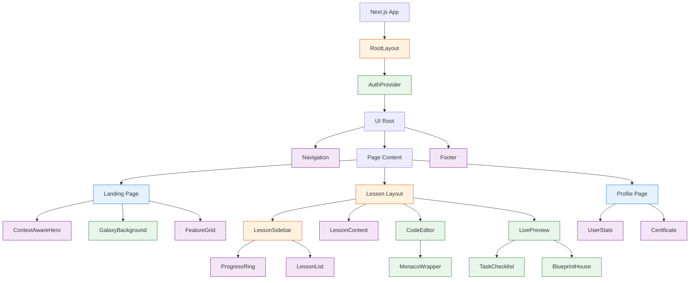

# 🧩 Component Hierarchy

## Key Components

-   **GalaxyBackground**: Complex 3D component managed by `useGalaxyWorker` and `useDeviceTier`.
-   **CodeEditor**: Wraps the Monaco Editor engine with custom themes and configuration for mobile optimizations.
-   **BlueprintHouse**: CSS 3D feature that reacts to progress state.
-   **TaskChecklist**: Real-time validation engine component using DOM parsing.
