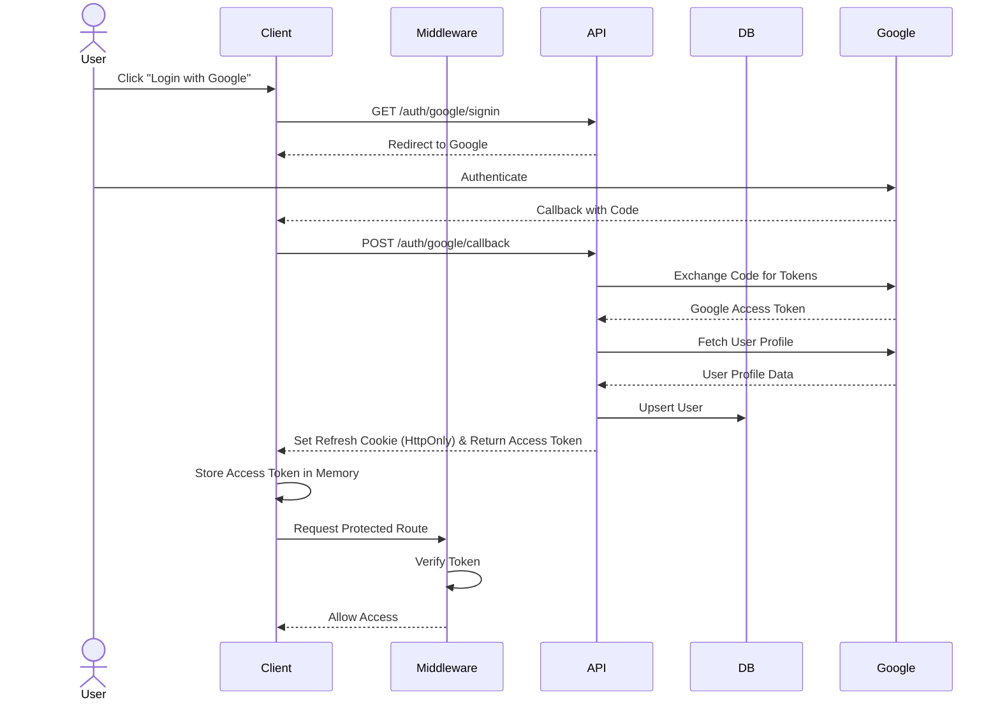
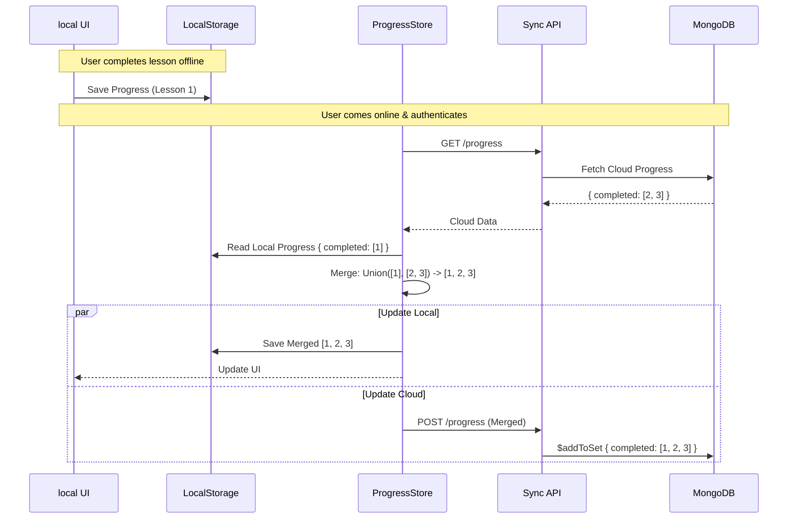

# 🔄 Data Flow Diagrams

## User Authentication Flow

```mermaid
sequenceDiagram
    actor User
    participant Client
    participant Middleware
    participant API
    participant DB
    participant Google

    User->>Client: Click "Login with Google"
    Client->>API: GET /auth/google/signin
    API-->>Client: Redirect to Google
    User->>Google: Authenticate
    Google-->>Client: Callback with Code
    Client->>API: POST /auth/google/callback
    API->>Google: Exchange Code for Tokens
    Google-->>API: Google Access Token
    API->>Google: Fetch User Profile
    Google-->>API: User Profile Data
    API->>DB: Upsert User
    API-->>Client: Set Refresh Cookie (HttpOnly) & Return Access Token
    Client->>Client: Store Access Token in Memory
    Client->>Middleware: Request Protected Route
    Middleware->>Middleware: Verify Token
    Middleware-->>Client: Allow Access
```

## Progress Synchronization Flow (3-Way Merge)

```mermaid
sequenceDiagram
    participant UI as local UI
    participant LS as LocalStorage
    participant Store as ProgressStore
    participant API as Sync API
    participant DB as MongoDB

    Note over UI, LS: User completes lesson offline
    UI->>LS: Save Progress (Lesson 1)
    
    Note over UI, DB: User comes online & authenticates
    
    Store->>API: GET /progress
    API->>DB: Fetch Cloud Progress
    DB-->>API: { completed: [2, 3] }
    API-->>Store: Cloud Data
    
    Store->>LS: Read Local Progress { completed: [1] }
    
    Store->>Store: Merge: Union([1], [2, 3]) -> [1, 2, 3]
    
    par Update Local
        Store->>LS: Save Merged [1, 2, 3]
        Store-->>UI: Update UI
    and Update Cloud
        Store->>API: POST /progress (Merged)
        API->>DB: $addToSet { completed: [1, 2, 3] }
    end
```
