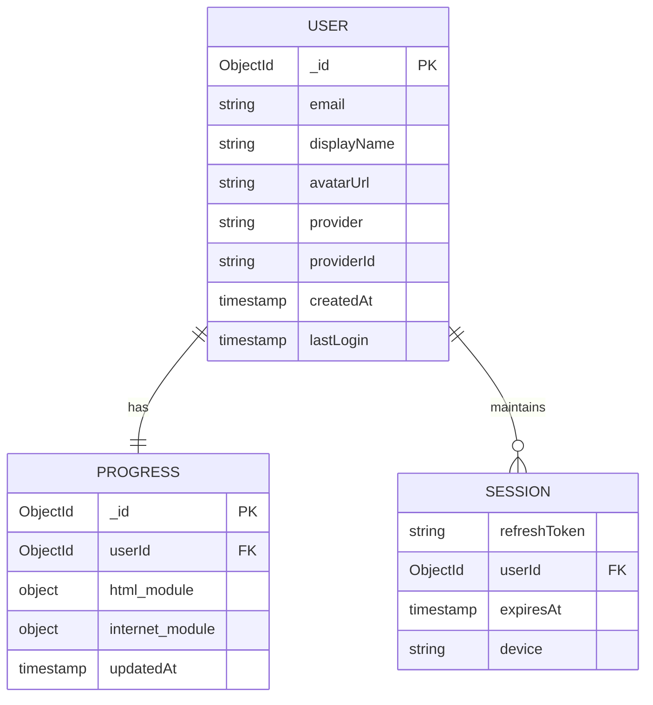

# 🍃 Database Schema

> ⚠️ **Note:** This is a simplified representation. Actual schema utilizes MongoDB specifically, but represented here as ERD for clarity.

## Schema Design Decisions

-   **Embedded Progress**: Instead of a separate `LessonCompletion` table, progress is embedded within a per-module structure in the `Progress` document. This allows fetching all progress for a module in a single query.
-   **Atomic Updates**: Because progress is structured as arrays (`completedLessons: [1, 2, 3]`), we can use MongoDB's `$addToSet` operator to safely merge progress from multiple devices without read-modify-write race conditions.
