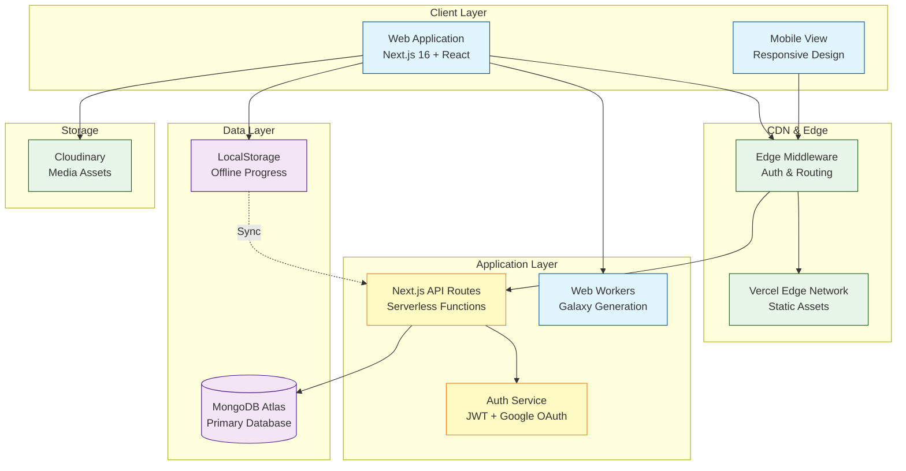

# 🏗️ System Architecture

## Architecture Overview

AstroShan utilizes a modern **Jamstack architecture** built on **Next.js**, leveraging serverless functions and edge middleware for scalability and performance. The system is designed to be **offline-first** for learning progress, syncing to the cloud when connectivity allows.

### Key Components

1.  **Client Layer**: A responsive Next.js application that adapts rendering strategies (WebGL vs. Canvas) based on device capabilities detected at runtime.
2.  **Edge Middleware**: Handles authentication checks and routing decisions at the network edge, reducing latency for global users.
3.  **Application Layer**: Serverless API routes handle business logic, progress synchronization, and profile management.
4.  **Data Layer**: A hybrid approach using MongoDB Atlas for persistent cloud storage and LocalStorage for immediate, offline access to course progress.
5.  **Web Workers**: Offloads heavy computational tasks (like galaxy particle generation) to background threads to keep the main UI thread responsive.

### Scalability & Performance

-   **Serverless**: Automatic scaling of API routes based on demand.
-   **Static Generation (SSG)**: Core lesson content is pre-rendered for maximum speed.
-   **CDN Caching**: Static assets and media serve from the edge.
-   **Adaptive Rendering**: Reduces GPU load on lower-end devices.

### Security

-   **Dual-Token Auth**: Secure, short-lived access tokens (in-memory) and HttpOnly refresh cookies.
-   **Edge Protection**: Middleware verifies tokens before requests reach origin functions.
