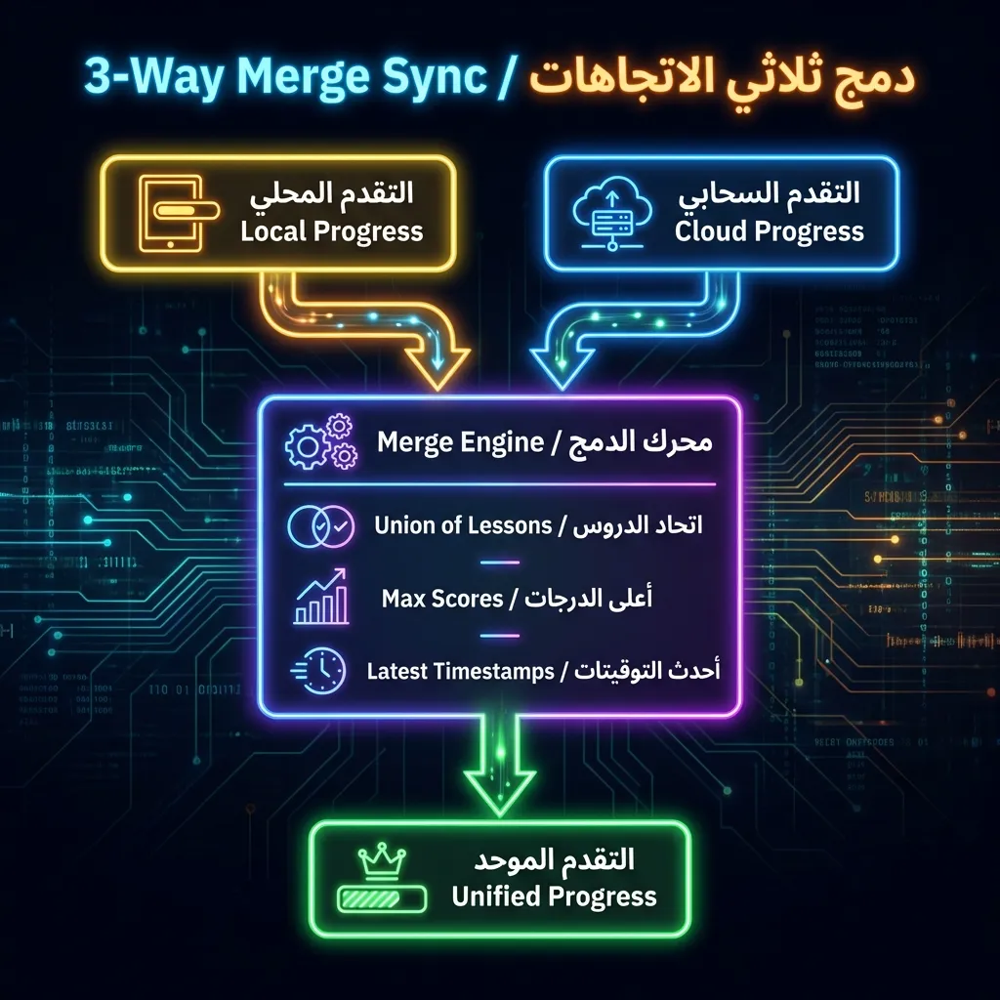

<div align="center">

# 🏗️ 03 - Solution Architecture


> **A deep dive into AstroShan's system design and component architecture**

<br/>

[](02-problem-statement.md)
[](04-key-features.md)

</div>

<div align="center">

</div>

<br/>

## 🏗️ System Overview

AstroShan is architected as a **full-stack Next.js 16 application** with serverless API routes, deployed on Vercel. The system serves three primary functions:

<div align="center">

| Function | Description |
|:--------:|:------------|
| 📚 **Content Delivery** | 67 interactive lessons with widgets |
| 📊 **Progress Management** | Anonymous-first with cloud sync |
| 🌌 **Immersive Visualization** | Adaptive 3D rendering |

</div>

```
┌─────────────────────────────────────────────────────────────────────┐
│                         🌐 CLIENT LAYER                              │
├───────────────────────────────────────────────────────────────────  ┤
│                                                                      │
│  ┌──────────────────────────────────────────────────────────────┐  │
│  │                    🎨 PRESENTATION LAYER                      │  │
│  │  ┌─────────────┐  ┌─────────────┐  ┌─────────────────────┐  │  │
│  │  │   🏠 Landing │  │  📚 Learning│  │   👤 User Dashboard │  │  │
│  │  │   - Hero    │  │  Modules    │  │   - Profile         │  │  │
│  │  │   - Galaxy  │  │  - Internet │  │   - Badges          │  │  │
│  │  │   - About   │  │  - HTML     │  │   - Stats           │  │  │
│  │  └─────────────┘  └─────────────┘  └─────────────────────┘  │  │
│  └──────────────────────────────────────────────────────────────┘  │
│                                                                      │
│  ┌──────────────────────────────────────────────────────────────┐  │
│  │                    🔄 STATE MANAGEMENT                        │  │
│  │  ┌─────────────┐  ┌─────────────┐  ┌─────────────────────┐  │  │
│  │  │  🔐 Auth    │  │ 📊 Progress │  │  🎛️ UI State        │  │  │
│  │  │  (Singleton)│  │  (Singleton)│  │  - Zustand          │  │  │
│  │  │  - Session  │  │  - Local    │  │  - Context          │  │  │
│  │  │  - Tokens   │  │  - Cloud    │  │  - Component        │  │  │
│  │  └─────────────┘  └─────────────┘  └─────────────────────┘  │  │
│  └──────────────────────────────────────────────────────────────┘  │
│                                                                      │
│  ┌──────────────────────────────────────────────────────────────┐  │
│  │                    🎮 RENDERING LAYER                         │  │
│  │  ┌──────────────────────────────────────────────────────────┐│  │
│  │  │              ⚙️ ADAPTIVE TIER SELECTION                   ││  │
│  │  │  🔴 High: WebGL + 100k particles (InteractiveGalaxy.tsx) ││  │
│  │  │  🟡 Med:  WebGL + 25k particles                          ││  │
│  │  │  🟢 Low:  Canvas 2D (StaticBackground.tsx)               ││  │
│  │  └──────────────────────────────────────────────────────────┘│  │
│  │  ┌───────────────┐          ┌────────────────────────────┐  │  │
│  │  │  ⚡ Web Worker │ ◄─────── │  useGalaxyWorker.ts        │  │  │
│  │  │  (Off-thread) │          │  (100k particle calc)      │  │  │
│  │  └───────────────┘          └────────────────────────────┘  │  │
│  └──────────────────────────────────────────────────────────────┘  │
│                                                                      │
├─────────────────────────────────────────────────────────────────────┤
│                         ⚡ API LAYER (Serverless)                    │
├─────────────────────────────────────────────────────────────────────┤
│  /api/auth/google/signin    POST  →  Initiate OAuth flow           │
│  /api/auth/google/callback  GET   →  Handle OAuth callback         │
│  /api/auth/token/refresh    POST  →  Refresh access token          │
│  /api/auth/token/revoke     POST  →  Invalidate refresh token      │
│  /api/progress              GET/POST → Read/write user progress    │
│  /api/profile               GET   →  Fetch user profile            │
│  /api/profile/avatar        POST  →  Upload avatar to Cloudinary   │
├─────────────────────────────────────────────────────────────────────┤
│                         💾 DATA LAYER                                │
├─────────────────────────────────────────────────────────────────────┤
│  ┌─────────────────┐          ┌──────────────────────────────────┐ │
│  │  🍃 MongoDB     │          │  🖼️ Cloudinary CDN               │ │
│  │  - user_progress│          │  - User avatars                   │ │
│  │  - users        │          │  - Auto WebP/AVIF                 │ │
│  └─────────────────┘          └──────────────────────────────────┘ │
└─────────────────────────────────────────────────────────────────────┘
```

<br/>

<div align="center">

</div>

<br/>

## 📁 Directory Structure

```
src/
├── app/                          # 🚀 Next.js 16 App Router
│   ├── api/                      # ⚡ Serverless API Routes
│   │   ├── auth/                 # 🔐 Authentication endpoints
│   │   │   ├── google/           # OAuth flow
│   │   │   └── token/            # JWT management
│   │   ├── profile/              # 👤 User profile
│   │   └── progress/             # 📊 Progress CRUD
│   │
│   ├── html/                     # 📄 HTML Module (57 lessons)
│   ├── internet/                 # 🌐 Internet Module (10 lessons)
│   ├── path/                     # 🌌 Galaxy Map navigation
│   ├── login/                    # 🔑 Authentication UI
│   ├── profile/                  # 👤 User dashboard
│   ├── showcase/                 # 🎮 Widget demonstrations
│   │
│   ├── layout.tsx                # 📐 Root layout (SEO, fonts)
│   ├── page.tsx                  # 🏠 Landing page
│   ├── globals.css               # 🎨 Design system
│   └── fonts/                    # 🔤 Arabic fonts
│
├── components/                   # 🧩 267 React Components
│   ├── auth/                     # 🔐 Auth UI (4)
│   ├── common/                   # ⚛️ Reusable atoms (7)
│   ├── guards/                   # 🛡️ Route protection (3)
│   ├── html/                     # 📄 HTML Module (163)
│   │   ├── lessons/              # 57 lesson directories
│   │   ├── ui/                   # Widget UI Kit
│   │   └── config/               # Lesson manifests
│   ├── internet/                 # 🌐 Internet Module (61)
│   ├── landing/                  # 🏠 Landing page (14)
│   ├── layout/                   # 📐 Header, navigation (3)
│   ├── path/                     # 🌌 Galaxy map (4)
│   ├── profile/                  # 👤 User dashboard (7)
│   └── seo/                      # 🔍 Structured data (1)
│
├── hooks/                        # 🔧 8 Custom Hooks
│   ├── useDeviceTier.ts          # 📱 Hardware detection
│   ├── useGalaxyWorker.ts        # ⚡ Web Worker for particles
│   ├── useGatekeeper.ts          # 🛡️ Course access control
│   ├── useHtmlLessons.ts         # 📄 HTML progress
│   ├── useInternetLessons.ts     # 🌐 Internet progress
│   └── ...
│
├── lib/                          # 🔧 Utilities
│   ├── auth/                     # 🔐 Auth system (8 files)
│   ├── db/                       # 🍃 MongoDB singleton
│   ├── progress/                 # 📊 Progress persistence
│   ├── workers/                  # ⚡ Web Worker scripts
│   └── ...
│
├── stores/                       # 📦 Zustand Global State
│   └── scrollStore.ts
│
├── context/                      # 🔄 React Context
│   ├── HeaderContext.tsx
│   └── ProgressBarContext.tsx
│
└── types/                        # 📋 TypeScript Definitions
    ├── htmlLessons.ts
    ├── internetLessons.ts
    └── badges.ts
```

<br/>

<div align="center">

</div>

<br/>

## 🔄 Data Flow

### 📊 User Progress Flow

```
┌─────────────────────────────────────────────────────────────────┐
│                    👤 USER ACTION: Complete Lesson               │
└─────────────────────────┬───────────────────────────────────────┘
                          │
                          ▼
┌─────────────────────────────────────────────────────────────────┐
│  📚 useHtmlLessons.ts                                            │
│  markComplete(lessonId)                                          │
└─────────────────────────┬───────────────────────────────────────┘
                          │
                          ▼
┌─────────────────────────────────────────────────────────────────┐
│  📦 ProgressStore.saveHtmlProgress()                             │
│  1. Update localStorage                                          │
│  2. Dispatch 'local-storage-update' event                        │
│  3. Check if authenticated                                       │
└─────────────────────────┬───────────────────────────────────────┘
                          │
         ┌────────────────┴────────────────┐
         │                                 │
    [🔓 Anonymous]                  [🔐 Authenticated]
         │                                 │
         ▼                                 ▼
┌─────────────────┐           ┌──────────────────────────────────┐
│  💾 Store local │           │  ☁️ MongoProgressAdapter.syncUser()│
│  (Complete)     │           │  1. Fetch cloud progress         │
└─────────────────┘           │  2. Merge (union) with local     │
                              │  3. Save merged to cloud         │
                              │  4. Update local (skipSync=true) │
                              └──────────────────────────────────┘
```

### 🔐 Authentication Flow

```
┌───────────────────────────────────────────────────────────────────┐
│                        🌟 FIRST VISIT                              │
└───────────────────────────────┬───────────────────────────────────┘
                                │
                                ▼
┌───────────────────────────────────────────────────────────────────┐
│  🔐 AuthStore.init()                                               │
│  1. Check localStorage for existing session                        │
│  2. If none → loginAnonymously() → Generate UUID                  │
│  3. If authenticated session → refreshAccessToken()               │
└───────────────────────────────┬───────────────────────────────────┘
                                │
           ┌────────────────────┴────────────────────┐
           │                                         │
    [❌ No stored session]                 [✅ Stored auth session]
           │                                         │
           ▼                                         ▼
┌───────────────────────┐              ┌───────────────────────────┐
│  🆔 Generate UUID     │              │  🔄 POST /api/auth/token/ │
│  isAuthenticated:false│              │       refresh             │
│  Store in localStorage│              │                           │
└───────────────────────┘              └───────────────┬───────────┘
                                                       │
                                          ┌────────────┴────────────┐
                                          │                         │
                                     [✅ Success]              [❌ Failure]
                                          │                         │
                                          ▼                         ▼
                                 ┌─────────────────┐     ┌──────────────────┐
                                 │ 🔑 Store access │     │ 🔓 Revert to     │
                                 │ token in memory │     │ anonymous        │
                                 │ (NOT localStorage)│   │ loginAnonymously()│
                                 └─────────────────┘     └──────────────────┘
```

### 🔄 3-Way Merge Sync (on Login)

```
┌─────────────────────────────────────────────────────────────────┐
│                     👤 USER LOGS IN (Google OAuth)               │
└───────────────────────────────┬─────────────────────────────────┘
                                │
                                ▼
┌─────────────────────────────────────────────────────────────────┐
│  📦 ProgressStore.syncUser(userId)                               │
└───────────────────────────────┬─────────────────────────────────┘
                                │
        ┌───────────────────────┼───────────────────────┐
        │                       │                       │
        ▼                       ▼                       ▼
┌───────────────┐     ┌─────────────────┐     ┌─────────────────┐
│  💾 LOCAL     │     │   ☁️ CLOUD      │     │  🔀 MERGE LOGIC │
│  (from anon)  │     │   (from DB)     │     │                 │
│               │     │                 │     │ Union: lessons  │
│  lessons: [3] │     │  lessons: [1,5] │  →  │ Max: quiz score │
│  quizScore: 80│     │  quizScore: 60  │     │ Latest: time    │
└───────────────┘     └─────────────────┘     └────────┬────────┘
                                                        │
                                                        ▼
                                              ┌─────────────────┐
                                              │  ✅ MERGED      │
                                              │  lessons: [1,3,5]│
                                              │  quizScore: 80  │
                                              └────────┬────────┘
                                                       │
                         ┌─────────────────────────────┴─────────────────────────────┐
                         │                                                           │
                         ▼                                                           ▼
              ┌─────────────────────┐                                 ┌──────────────────────┐
              │  💾 Update local    │                                │  ☁️ Save to MongoDB  │
              │  (skipSync = true)  │                                │  (atomic $addToSet)  │
              └─────────────────────┘                                └──────────────────────┘
```

**Visual Diagram:**



<br/>

<div align="center">

</div>

<br/>

## 🎨 Component Hierarchy

### 🏠 Landing Page

```
LandingPage (page.tsx)
├── 🧭 Header
│   ├── Logo
│   ├── Navigation
│   └── ProfileMenu (auth-aware)
│
├── 🌌 Scene [lazy loaded, ssr: false]
│   ├── InteractiveGalaxy (high tier)
│   │   ├── useGalaxyWorker → Web Worker
│   │   ├── 100k particles
│   │   └── CameraRig
│   └── StaticBackground (low tier)
│       └── Canvas 2D fallback
│
├── 🦸 Hero (6 variants)
│   ├── GuestHero
│   ├── GuestWithProgressHero
│   ├── NewExplorerHero
│   ├── InProgressHero
│   ├── BridgeTravelerHero
│   └── CourseMasterHero
│
├── ❓ WhyCodeShan [lazy loaded]
│   └── Feature cards (6)
│
└── 👤 AboutMe [lazy loaded]
    └── Developer profile
```

### 📚 HTML Learning Flow

```
HtmlPage (app/html/page.tsx)
├── 🛡️ RequireBridgeAuthorized (guard)
│
├── 📋 HtmlLessonsList
│   ├── 🏠 BlueprintHouse (CSS 3D)
│   │   ├── HoloBase (foundation)
│   │   ├── HoloFace (walls)
│   │   ├── HoloRoofFace (roof)
│   │   └── OrbitingRing (particles)
│   │
│   └── 📚 LessonCards (57)
│       └── LessonConnector (progress lines)
│
└── 📖 HtmlLessonView (when lesson selected)
    ├── HtmlLessonContent
    │   ├── LessonSection
    │   ├── InfoCard
    │   ├── Interactive Widgets (varies)
    │   └── Quiz
    │
    └── 💻 CodeEditorView
        ├── MonacoEditor
        ├── PreviewFrame (iframe)
        └── TaskChecklist
            └── Validation results
```

<br/>

<div align="center">

</div>

<br/>

## 🔐 Security Architecture

### 🔑 Token Strategy

<div align="center">

| Token | Lifetime | Storage | Purpose |
|:-----:|:--------:|:-------:|:--------|
| 🔑 Access Token | 15 min | In-memory only | API authorization |
| 🔄 Refresh Token | 7 days | HttpOnly cookie | Silent token rotation |

</div>

### 🛡️ Security Headers (next.config.ts)

```typescript
const securityHeaders = [
  { key: "Strict-Transport-Security", value: "max-age=63072000; includeSubDomains; preload" },
  { key: "X-Content-Type-Options", value: "nosniff" },
  { key: "Referrer-Policy", value: "strict-origin-when-cross-origin" },
  { key: "Permissions-Policy", value: "camera=(), microphone=(), geolocation=()" },
  { key: "X-DNS-Prefetch-Control", value: "on" },
];
```

### 🔒 Why In-Memory Tokens?

<table>
<tr>
<td align="center" width="50%">

**✅ XSS Prevention**
Even if malicious script executes, it cannot access `authStore.accessToken` (closed over in singleton).

</td>
<td align="center" width="50%">

**✅ CSRF Prevention**
Refresh token uses `SameSite=Strict` cookie - cannot be sent from other origins.

</td>
</tr>
</table>

<br/>

<div align="center">

</div>

<br/>

## ⚡ Performance Architecture

### 🎮 Rendering Tier Selection

```typescript
// useDeviceTier.ts
function getHardwareTier(): DeviceTier {
  if (typeof navigator === "undefined") return "low";
  const cores = navigator.hardwareConcurrency || 4;
  if (cores >= 6) return "high";   // 100k particles, full WebGL
  if (cores >= 2) return "medium"; // 25k particles
  return "low";                    // Canvas 2D fallback
}
```

### ⚡ Web Worker Offloading

```
Main Thread                       Web Worker
     │                                │
     │  postMessage(params)           │
     ├───────────────────────────────►│
     │                                │
     │                           [Calculate 100k
     │                            particle positions
     │                            and colors]
     │                                │
     │  onmessage(Float32Array)       │
     │◄───────────────────────────────┤
     │                                │
     │  Update Three.js               │
     │  BufferAttribute               │
     │  (zero-copy transfer)          │
     ▼                                ▼
```

### 📦 Bundle Optimization

<div align="center">

| Strategy | Implementation | Impact |
|:--------:|:---------------|:-------|
| 🎬 LazyMotion | Global provider, `m` components | Reduced Framer Motion bundle |
| 📦 Dynamic imports | `next/dynamic` for heavy components | Code splitting |
| 🌲 optimizePackageImports | drei, react-icons, framer-motion | Tree shaking |
| 🎨 Critical CSS | Critters inlining | Faster FCP |
| 🖥️ Server-Side LCP | Hero text from server | 0ms text render |

</div>

<br/>

<div align="center">

</div>

<br/>

## 🗄️ Database Schema

### 🍃 MongoDB Collections

**user_progress**
```javascript
{
  _id: ObjectId,
  userId: String,           // From AuthStore session
  internet: {
    completedLessons: [Number],
    passedQuizzes: [Number]
  },
  html: {
    completedLessons: [Number],
    hasShownWelcome: Boolean,
    hasShownUnlockAnimation: Boolean
  },
  bridgeAuthorized: Boolean,
  displayName: String,
  avatarUrl: String,
  updatedAt: Date
}
```

### 🔗 Connection Pooling

```typescript
// mongodb.ts - Serverless-safe singleton
let clientPromise: Promise<MongoClient>;

if (process.env.NODE_ENV === 'development') {
  // Cache in global to survive HMR
  const globalWithMongo = global as typeof globalThis & {
    _mongoClientPromise?: Promise<MongoClient>;
  };
  if (!globalWithMongo._mongoClientPromise) {
    client = new MongoClient(uri, options);
    globalWithMongo._mongoClientPromise = client.connect();
  }
  clientPromise = globalWithMongo._mongoClientPromise;
} else {
  client = new MongoClient(uri, options);
  clientPromise = client.connect();
}
```

<br/>

<div align="center">

</div>

<br/>

## 🔗 Related Documents

<div align="center">

| Navigation |
|:----------:|
| [❓ ← Problem Statement](02-problem-statement.md) |
| [✨ Key Features →](04-key-features.md) |
| [🔧 Technical Decisions →](05-technical-decisions.md) |

</div>

<br/>

<div align="center">

---

*Next: [04 - Key Features](04-key-features.md)*

</div>
